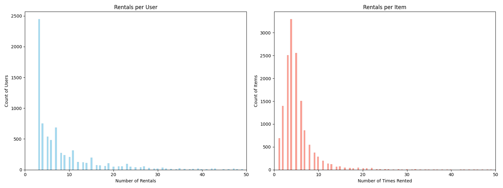
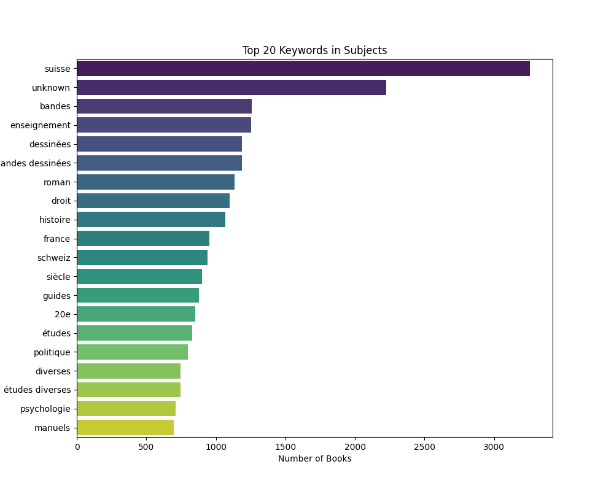

# 📚 University Library Recommender System - Team Migros

## 📖 Overview
This project aims to enhance the student experience on the university library platform by integrating a personalized recommendation system. By analyzing rental histories, the "You might also like..." feature predicts and suggests academic and leisure materials tailored to individual interests, thereby fostering deeper user engagement and discovery.

To further elevate the overall user experience, the platform introduces three innovative features:
* **Best-seller recommender**: under the personalized recommendation, the reader have access to the list of the 10 books the most read that they have not rented yet.
* **Book Friend Recommender**: This social tool matches readers based on shared reading habits to encourage intellectual exchange and community building. Its ultimate goal is to facilitate book discussions and inspire the formation of local book clubs.
* **Cumulus Fidelity Integration**: Developed in partnership with the Migros group, the app allows readers to earn Cumulus points for every library rental. This incentive program is designed to reward frequent readers and increase long-term fidelity to the library system.

## 🗄 Exploratory Data Analysis (EDA)
Our analysis focused on two primary datasets:
# **Interactions:**
This dataset shows the interaction between the users and the books for the last 2 years. In total the dataset shows 87,047 rental records across 7,838 unique users and 15.109 books.

In average, user rented a total of 11.11 book and each book has been rented an average of 5.76 times. 

**_Graph 1: Distribution of the rentals_**

This graph shows the distribution of the rentals per users and per items.
The distribution of rentals per user is heavily skewed to the left:
*  **The Majority**: Most users are "casual" readers who have interacted with only 2 to 5 books.
*  **The Tail**: Only less than 13% of users have rented more than 20 items, creating a long tail that stretches toward the right.

The "Rentals per Item" graph shows how the library collection is utilized:
*  **Niche vs. Popular**: The peak indicates that most books have been rented roughly 4 to 6 times.
*  **Concentration**: There is a sharp drop-off after 10 rentals, indicating that only a small fraction of the books (7%) are "bestsellers" with high circulation numbers.

# **Metadata:**
The second pillar of our system is book metadata, providing details on 15,109 items including Titles, Authors, Publishers, and Subjects.
Here is an example of the data for 3 different books chosen randomly in the dataset.

| ItemID | Title | Author | Publisher | Subjects |
| :--- | :--- | :--- |:--- |:--- |
| 4357 | Charlotte Olivier : la lutte contre la tuberculose dans le canton de Vaud  | Heller, Geneviève | Ed d'en bas | Tuberculosis, Pulmonary--prevention & control; Tuberculosis, Pulmonary--history; lutte contre la tuberculose--Olivier, Charlotte--Vaud (Suisse)--19e s. (fin) / 20e s. (début); Switzerland |
| 9235 | Commentaire du Code pénal suisse / (Art. 1-110) | Logoz, Paul | Delachaux et Niestlé | droit pénal--Suisse--[manuel] |
| 3818 | Petar & Liza | Sekulić-Struja, Miroslav | Actes Sud | Bandes dessinées |

**_Table 1: Example of the item dataset_**

The visualization below highlights the dominant keywords within the library's **Subjects** metadata, revealing a clear geographic and thematic focus.

The term **"Suisse"** is the most frequent descriptor, appearing in over 3,000 records. Following this geographic marker, the dataset is categorized by literary forms, such as **"Bandes dessinées"** (comics) and **"Romans"** (novels). Additionally, academic and topical keywords like **"enseignement"** (education), **"droit"** (law), and **"histoire"** (history) appear with significant frequency.

**_Graph 2: Top Keywords in the Subject Dataset_**

## 🛠 Methodology & Algorithms
Our approach evolved from basic collaborative filtering to a complex hybrid system that integrates user behavior with book metadata and readers' behaviours.

### 1. Collaborative Filtering (CF)
We began by implementing two foundational collaborative filtering techniques using **Jaccard Similarity** to measure the relationship between vectors in our interaction matrix.

* **User-User CF:** This method identifies "neighbor" users who have similar rental histories. If User A and User B have both rented several of the same books, the system recommends other books rented by User B to User A.
* **Item-Item CF:** This method focuses on the relationships between books rather than users. It calculates similarity based on how often two books are rented by the same people. If a student rents a book on "Sociology," the system identifies other books with high similarity scores to that item.

For those two recommencer, the Jaccard similarity was used since it was more effective than the cosine similarity seen in class. The Jaccard similarity measures the proportion of shared items between two sets by calculating the size of their intersection divided by the size of their union. In our context, it effectively identifies "reader twins" or similar books by comparing the overlap of binary interactions, rather than measuring the angle between vectors as cosine similarity does.

### 2. The First Hybrid & Weight Optimization
We realized that neither model was perfect on its own. To find the "sweet spot," we created **Hybrid 1**, which combines the prediction scores of both models. We ran an optimization loop testing different weight ratios (from 5/95 to 95/5) to maximize **Precision@10**. We achieved an initial baseline precision of **18.09%** (cross-validation in the interaction dataset)

| Model | Precision@10 | Recall@10 |
| :--- | :--- | :--- |
| **User-User CF** | 17.05% | 88.62% |
| **Item-Item CF** | 16.08% | 80.76% |

**_Table 2: Initial Performance Comparison_**

**Optimal Weight:** **58% User-User / 42% Item-Item**.
This hybrid recommender obtained a score of 16.38% on Kaggle.

---

### 3. Integrating Additional Elements
To further refine the recommendations, we experimented with three metadata-driven "boosters":

* **Title**: Utilizing **TF-IDF** (Term Frequency-Inverse Document Frequency) to find linguistic proximity between titles.
* **Subject**: Utilizing **TF-IDF** (Term Frequency-Inverse Document Frequency) to find linguistic proximity between subjects.
* **History**: We identified a high probability of students re-renting known books and used this as a weighted booster.
* **Data Bias**: We exploited a pattern in the dataset where users frequently rent books with consecutive ItemIDs.

When tested in isolation (without the CF base), these techniques were not effective as they lacked the depth of personalized interaction data. 

| Technique | Precision@10 | Recall@10 |
| :--- | :--- | :--- |
| **Title text analytics only** | 3.8% | 21% |
| **Subject text analytics only** | 3.4% | 17.2% |
| **History only** | 5.1% | 24.3% |
| **Data Bias only** | 1.8% | 6.6% |

**_Table 3: Individual Component Performance (Before Hybridization)_**
_The precision and recall numbers presented in the table are assessed using a cross validation technique for the test sets._

During our process, we tested various other recommender to try to improve the precision of the recommender, but some were not improving the effectiveness:
* **Fame (Popularity):** Utilizing the number of times a book was rented to identify globally popular books was not effective.
* **Author Loyalty:** Identifying authors the user has previously rented to suggest their other works did not improve the overall effectiveness.
* **Publisher Loyalty** Identifying publisher the user has previously rented to suggest their other works did not improve the overall effectiveness of the recommender.

---

### 4. The Final "All-In" Hybrid Model
The ultimate version of our recommender system combines the high-performing components of **Hybrid 1** (user-user & item-item) with the list of boosters that had a positive impact on the overall result. This ensures that while collaborative patterns drive the results, personal preferences for specific subjects provide the final "nudge" for accuracy.

#### Final Model Configuration & Results

| Component | Weight (%) | 
| :--- | :--- |
| **User-User CF** | 29.8% |
| **History** | 25% |
| **Item-Item CF** | 22.1% |
| **Data Bias** | 13.5% |
| **Title Text Analytics** | 7.7% | 
| **Subject Text Analytics** | 1.9% | 

**_Table 4: Hybrid 2 recommender composition_**

| Final Model | Final Score on Kaggle |
| :--- | :--- |
| **Hybrid 2** | 17.55% |

**_Table 5: Hybrid 2 (final) recommender performance_**
---

### 5. Additional Note
To maintain scientific integrity while ensuring the highest possible recommendation quality, we adopted a dual-phase training and evaluation strategy:
*  **Validation Phase**: For the performance metrics (Precision@10 and Recall@10) of our recommender reported in our performance tables 2 & 3, we utilized a temporal 80/20 train-test split, combined with 5-fold cross-validation. This allowed us to rigorously assess the predictive power of each model on "unseen" data without any data leakage.

*  **Production Phase**: Once the optimal hyperparameters and weights were identified via validation, we retrained the final model using 100% of the available interaction data. This "all-in" approach was used to generate our final Kaggle submissions and powers our Streamlit user interface, ensuring the system leverages every available data point to provide the most accurate real-world recommendations.
---

## 📊 Performance Demonstration

### Positive Case Study: User XX
* **Past Rentals**: [History Details]
* **Our Recommendation**: [Prediction Details]
* **Analysis**: Our model accurately identified that this reader prefers **[Subject]** books. By utilizing **[Specific Recommender]**, we achieved a successful hit on the user's future interest.

### Negative Case Study: User XX
* **Past Rentals**: [History Details]
* **Our Recommendation**: [Prediction Details]
* **Analysis**: Our model accurately identified that this reader prefers **[Subject]** books. By utilizing **[Specific Recommender]**, we achieved a successful hit on the user's future interest.

---
## ⚠️ Limitations
* **Sparsity**: More than 30% of users have rented fewer than 4 books, making it difficult to establish strong personalized trends for new users.
---

## 💻 User Interface

The dashboard was built entirely with Streamlit and styled through injected custom CSS to feel like a native web application rather than a standard data tool. The visual identity blends Migros corporate design with a Netflix-style card grid layout for browsing books. Migros orange is used as the dominant accent color throughout the web app, combined with the Sora typeface for headings and DM Sans for body text. The default Streamlit header, footer, and sidebar are hidden, replaced by a custom sticky navigation bar with the Migros Library branding that sits at the top of every page.

**Authentication and Personalization:**  
Users sign in with their Cumulus Number, which is the same ID that appears in the interactions dataset, combined with any password. The system checks the number against the dataset on submission and pre-loads the user's full reading history into the session. If the number is not found, login is rejected with a clear error message. Each user is also assigned a personal animal avatar from a pool of 30 emoji such as 🦊, 🐻, 🦁 and others. The avatar is derived by hashing the user ID, so every reader always sees the same animal across sessions. The same logic applies consistently to all other readers visible in the leaderboard. On logout, all session state is cleared and the user is returned to the login screen.

**Book Cards and Cover Images:**  
Books are displayed as a responsive grid of cards. Cover images are fetched from the Google Books API using the ISBN first, with a fallback to a title-based search if no ISBN match is found. All results are cached in session state so repeated visits to the same book never trigger a second API call. When no cover is available from the API, which is frequent for older or more niche academic titles in this library's collection, a custom SVG placeholder is generated. Each placeholder has a gradient background, a book icon, and the book title. The color scheme is assigned by hashing the book title, so the same book always renders the same cover style regardless of who views it or when. Descriptions fetched from the API are stripped of any HTML formatting and shown as a short text snippet beneath the subject tag, if this information is available. The subject itself is taken from items metadata.

**The Five Tabs:**
  * The **Recommendations tab** displays the top 10 personalized picks from the Hybrid 2 model for the logged-in user, showing up to 20 cards per view. The author name on each card has two functions: it opens an external link to the author's Wikipedia search page, and a button saying "🔍 Books by [Author]" activates an in-dashboard filter that narrows the visible cards to other books by that same author present in the dataset. A banner appears at the top of the tab when a filter is active, with a button to clear it and return to the full recommendation list.
  * The **My History tab** shows all books the user has read historically plus any additionally marked as read during the current session. A summary banner at the top displays the total Cumulus Points earned and how they break down per book. The books in the history do not show a Mark as Read button.
  * The **Top 10 tab** ranks the ten most interacted books across the full dataset, weighted by both reading frequency and how often a book appears across recommendation lists. The results appear first as a compact ranked list with read counts, then again as a visual card grid below so users can explore covers and descriptions and mark books as read directly from this view.
  * The **Book Club tab** automatically scans the full recommendations dataset to find the five users whose recommended book lists overlap most with the logged-in user's own recommendations. The overlap is usually just one book recommendation. The matching runs entirely on set intersection with no manual input required. For each matched reader, their shared books are shown as a card row so both people can immediately see what titles they have in common and potentially use that as a starting point for a book club.
  * The **Leaderboard tab** ranks all users by Cumulus Points and displays the top 50 readers. A summary panel at the top shows the current user's personal rank, their points total, and the total number of active readers in the system. If the user is among the top 50 users, the logged-in user's row is highlighted in orange throughout the table so it is easy to locate the position.

**Cumulus Points and Gamification:**  
The Cumulus Points system is the main engagement mechanic of the platform, built in the spirit of the Migros Cumulus loyalty programme. Every book a user has read is worth 50 points, and every additional book marked as read within the app adds another 50 points immediately. The running total appears in four places at once: the sticky header, the hero welcome banner, the Reading History tab, and the Leaderboard. All four update on the next render after any new book is marked, creating a direct feedback loop between reading activity and visible reward.

View the app here: 

---

## 📺 Project Video
Our YouTube video includes a presentation of the interface, ...

[**Watch the Presentation & Demo Here**](YOUR_YOUTUBE_LINK_HERE)

---

## 👩‍💻 Logistics
* **Team Name:** Migros - Micha Streuli & Noé Délèze
* **Kaggle Leaderboard Score:** 0.XXXX (Top X%)

---
